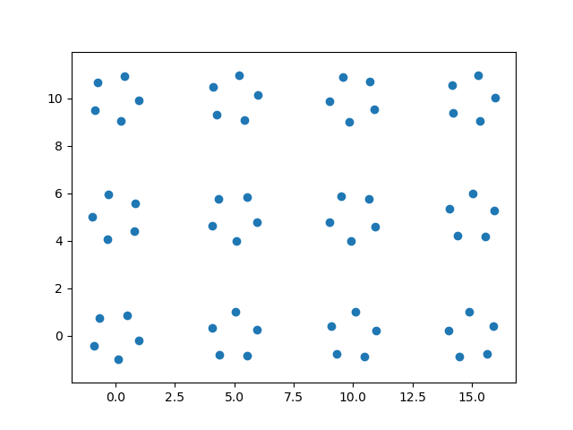

<!--https://yuchen-xiyue.github.io/notes/programming/numpy-dimension-broadcast.html-->


## Dimension extension

ndarray对象可通过在数组索引中使用 `np.newaxis` (可简写为`None`)来指定需要扩充的轴：

```python
>>> import numpy as np
>>> foo = np.array([[1, 1, 4], [5, 1, 4]])
>>> foo.shape
(2, 3)
>>> foo[None].shape  # expand axis 0
(1, 2, 3)
>>> foo[..., None].shape  # expand axis -1
(2, 3, 1)
>>> foo[:, None, :].shape  # expand axis 1
(2, 1, 3)
```

## Broadcast

> General Broadcasting Rules: When operating on two arrays, NumPy compares their shapes element-wise. It starts with the trailing (i.e. rightmost) dimensions and works its way left. Two dimensions are compatible when 1. they are equal, or 2. one of them is 1.

广播规则：当对两个ndarray对象进行一般操作时，从右到左比较每一条轴上的大小，当每一条轴上大小都相等或其中一个为1时，判定他们为互相对应。

```python
>>> foo = np.array([[1, 1, 4], [5, 1, 4]])
>>> bar1 = np.array([[1, 2, 0]])
>>> bar2 = np.array([[2], [1]])
>>> foo.shape
(2, 3)
>>> foo * foo  # same shape
[[ 1  1 16]
 [25  1 16]]
>>> bar1.shape
(1, 3)
>>> foo + bar1  # broadcast along axis 0
[[2 3 4]
 [6 3 4]]
>>> bar2.shape
(2, 1)
>>> foo / bar2  # broadcast along axis 1
[[0.5 0.5 2. ]
 [5.  1.  4. ]]
>>> -1 * foo  # broadcast along all axes
[[-1 -1 -4]
 [-5 -1 -4]]
```

练习1 - 画很多五角星的端点

```python
>>> import matplotlib.pyplot as plt
>>> def R(angle):
>>>     c, s = np.cos(angle), np.sin(angle)
>>>     return np.array([[c, -s], [s, c]])
>>> def matmul(a, b):
>>>     return np.einsum('ij...,jk...->ik...', a , b)
>>> pentagram = matmul(R(np.arange(5)*0.4*np.pi), np.array([0, 1])[:, None, None])  # (2, 1, 5)
>>> H, W, interval = 3, 4, 5
>>> coords = np.mgrid[0: H, 0: W] * interval # (2, H, W)
>>> rot_matrix = R(np.random.randn(H * W))  # (2, 2, H*W)
>>> X = matmul(rot_matrix[:, :, None, :], pentagram[:, :, :, None])  # (2, 1, 5, H*W)
>>> X = X + coords.reshape((2, -1))[:, None, None, :]  # (2, 1, 5, H*W)
>>> X = X.reshape((2, -1))  # (2, 5*H*W)
>>> plt.scatter(X[1, :], X[0, :])
>>> plt.gca().axis('equal')
>>> plt.show()
```

